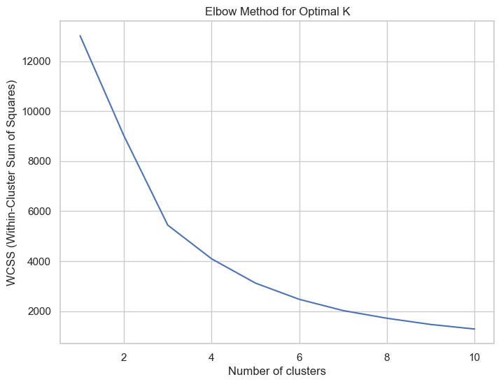
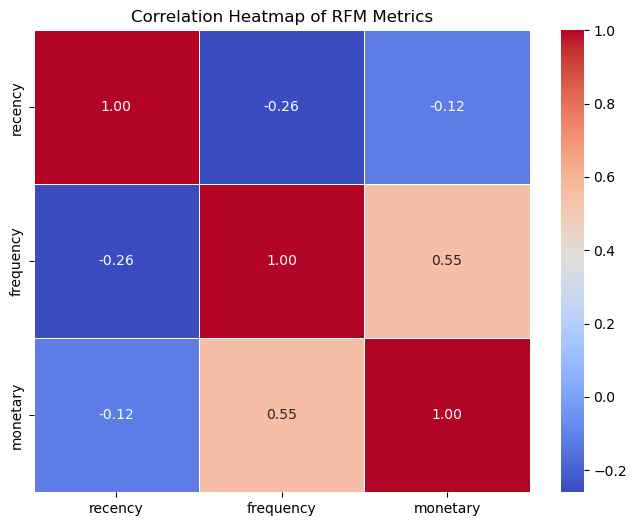
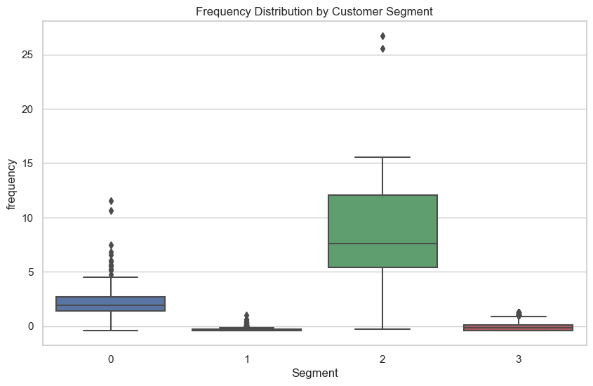
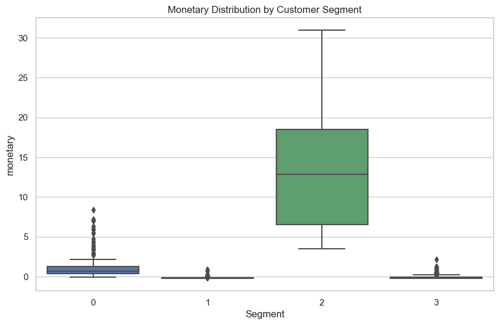
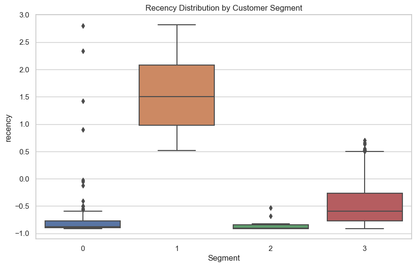
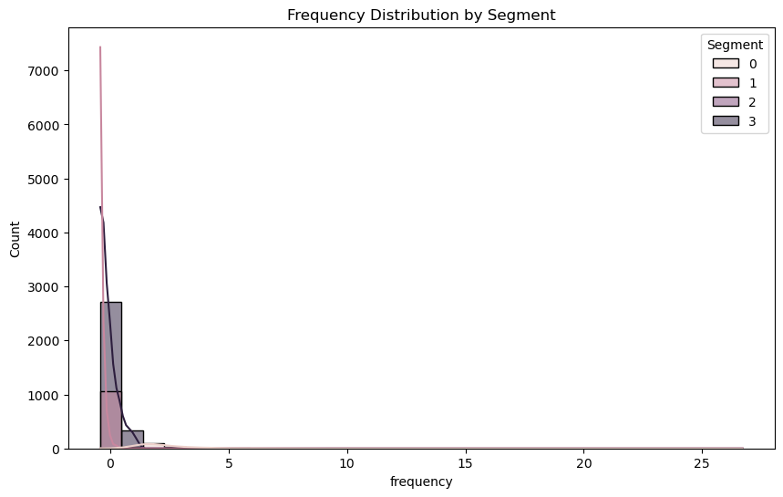
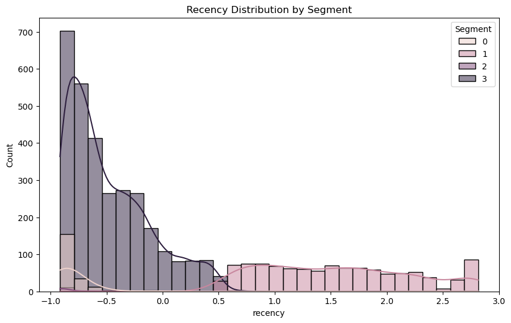
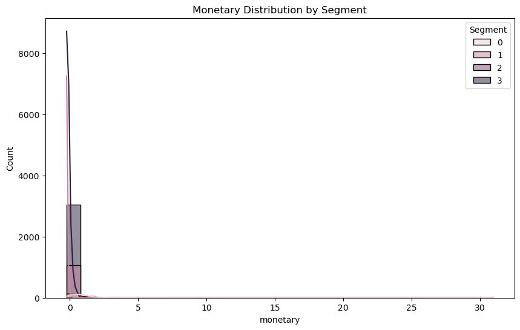
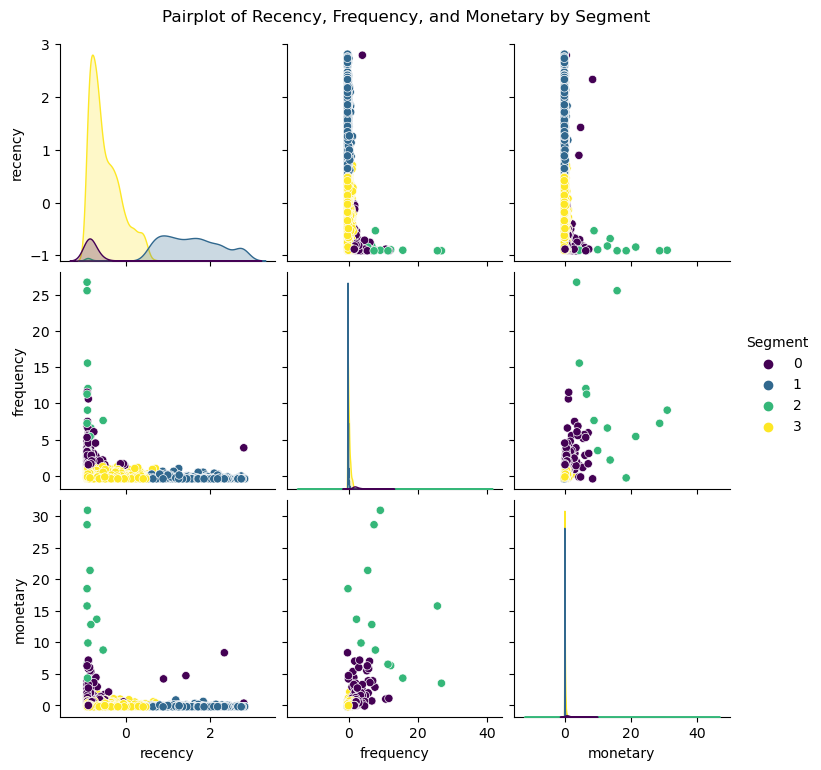

# E-commerce Customer Segmentation and Profiling

## Project Overview
This project segments e-commerce customers based on **Recency**, **Frequency**, and **Monetary** (RFM) metrics. The goal is to identify distinct customer segments for targeted marketing strategies.

## Methodology
We applied **KMeans clustering** to segment customers and then used **Principal Component Analysis (PCA)** to visualize the segmentation. We evaluated the model's performance using the **Silhouette Score** and **Davies-Bouldin Index**.

### Steps:
1. **Data Preprocessing**: Cleaned and transformed raw data (handling missing values, outliers, and date conversion).
2. **Segmentation**: Performed customer segmentation using **KMeans** based on RFM metrics.
3. **Evaluation**: Used **PCA** for dimensionality reduction and **Silhouette Score** and **Davies-Bouldin Index** for model evaluation.

## Visualizations

### 1. Elbow Method for Optimal Clusters
The Elbow Method plot helps determine the optimal number of clusters for customer segmentation.

### 2. 2D PCA Scatter Plot
A 2D PCA scatter plot visualizing customer segments.
.png)

### 3. 3D Customer Segments
A 3D plot of the customer segments based on Recency, Frequency, and Monetary metrics.
.png)

### 4. Correlation Heatmap for RFM Metrics
Correlation heatmap showing how Recency, Frequency, and Monetary metrics relate to each other.

### 5. Frequency, Monetary, and Recency Distribution Boxplots
These are separate boxplots showing the distribution of **Frequency**, **Monetary**, and **Recency** metrics across customer segments. A boxplot helps us understand the central tendency and spread of each metric, highlighting the following:
- **Median** (central line inside the box) shows the middle value of the metric.
- **Interquartile Range (IQR)**: The box represents the range between the 25th and 75th percentiles, showing where most of the data lies.
- **Outliers**: The points outside the "whiskers" indicate potential outliers, or extreme values.
  
These visualizations are important to identify if any customer segments exhibit skewed distributions, outliers, or unusual behaviors.

#### Frequency Boxplot
The **Frequency Boxplot** reveals how often customers make purchases within each segment, helping us understand whether most customers are frequent or occasional buyers.

#### Monetary Boxplot
The **Monetary Boxplot** displays the distribution of how much money customers in each segment are spending. This can show whether there are high-value segments with customers making large purchases or low-value segments.

#### Recency Boxplot
The **Recency Boxplot** shows the recency of customer purchases. This helps businesses identify customer segments based on their recent activity, with longer times between purchases indicating less engagement.

### 6. Frequency, Recency, and Monetary Distribution Histograms
These histograms show the **distribution of Frequency**, **Recency**, and **Monetary** values across customer segments. Unlike boxplots, histograms represent the frequency of data points within certain ranges (bins). Each of the three histograms provides insights into the data distribution:

#### Frequency Histogram
This histogram shows how frequently customers are making purchases. Peaks in the histogram represent ranges of frequency that contain many customers. A long tail or skew might indicate a few very frequent buyers.

#### Recency Histogram
The **Recency Histogram** reveals how recently customers made purchases, with higher frequencies at the lower end (more recent purchases). This helps identify active customers in each segment.

#### Monetary Histogram
The **Monetary Histogram** shows how much money customers spend. A skewed distribution may indicate that only a small proportion of customers are contributing the majority of the revenue.

### 7. Pairplot of Recency, Frequency, and Monetary
A pairplot of Recency, Frequency, and Monetary for visualizing relationships between the three metrics.

## Requirements

- pandas
- numpy
- matplotlib
- seaborn
- sklearn

## Conclusion
This project helps businesses better understand their customer base and apply targeted marketing strategies based on customer segmentation.
